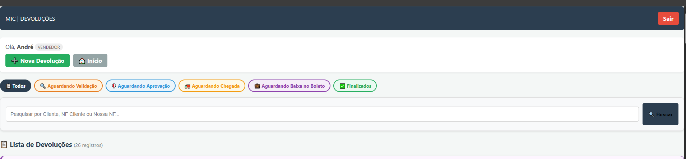
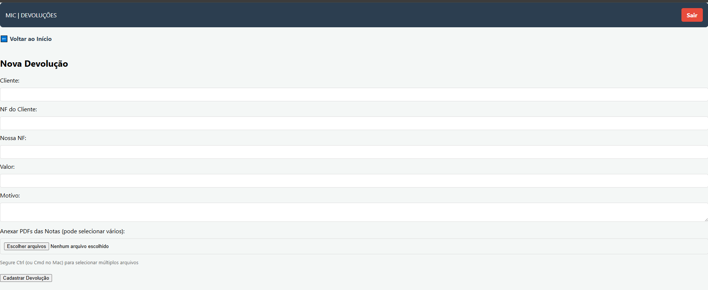
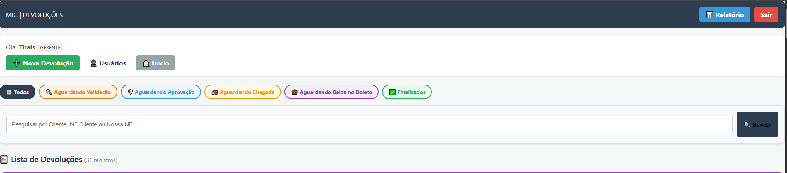
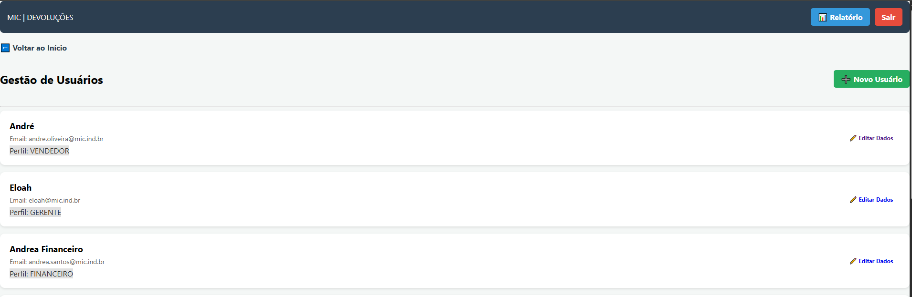
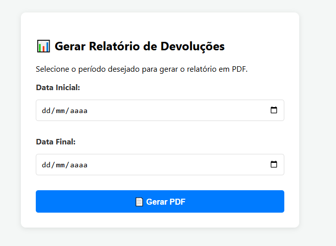

# 📦 Sistema de Devoluções — MIC


> Sistema web desenvolvido para gerenciar o fluxo completo de devoluções de mercadorias, desde o lançamento pelo vendedor até a finalização pelo financeiro — com controle de acesso por perfil, upload de notas fiscais e geração de relatórios em PDF.

🌐 **[Acesse o sistema em produção](https://andredevolucoes.pythonanywhere.com/)**

---

## 🖥️ Screenshots

<table>
  <tr>
    <td align="center"><b>Tela de Login</b></td>
    <td align="center"><b>Dashboard — Vendedor</b></td>
  </tr>
  <tr>
    <td></td>
    <td></td>
  </tr>
  <tr>
    <td align="center"><b>Nova Devolução</b></td>
    <td align="center"><b>Dashboard — Gerente</b></td>
  </tr>
  <tr>
    <td></td>
    <td></td>
  </tr>
  <tr>
    <td align="center"><b>Gestão de Usuários</b></td>
    <td align="center"><b>Geração de Relatório PDF</b></td>
  </tr>
  <tr>
    <td></td>
    <td></td>
  </tr>
</table>

---

## 🚀 Funcionalidades

- 🔐 **Autenticação** com login e controle de sessão
- 👥 **Controle de acesso por perfil**: Vendedor, Conferente, Gerente e Financeiro
- 📋 **Fluxo completo de devolução** com etapas rastreáveis:
  - `Aguardando Validação` → `Aguardando Aprovação` → `Aguardando Chegada` → `Aguardando Baixa no Boleto` → `Finalizado`
- 📎 **Upload de notas fiscais em PDF** vinculadas à devolução
- 🔍 **Busca e filtros** por cliente, NF do cliente e NF interna
- 📊 **Geração de relatório em PDF** por período (exclusivo para gerentes)
- ✏️ **Edição de devoluções** enquanto ainda estão na etapa inicial
- 🕐 **Registro de datas e responsáveis** em cada etapa do fluxo

---

## 🏗️ Estrutura do Projeto

```
devolucoes_app/
├── app.py              # Rotas e lógica principal da aplicação
├── models.py           # Modelos do banco de dados (Usuario, Devolucao, DevolucaoPDF)
├── config.py           # Configurações da aplicação
├── Procfile            # Configuração para deploy
├── requirements.txt    # Dependências do projeto
├── static/             # Arquivos estáticos (CSS, uploads)
├── screenshots/        # Screenshots do sistema
└── templates/          # Templates HTML (Jinja2)
```

---

## ⚙️ Como rodar localmente

### Pré-requisitos

- Python 3.10+
- pip

### Instalação

```bash
# Clone o repositório
git clone https://github.com/andregabriel-dev/devolucoes_app.git
cd devolucoes_app

# Crie e ative o ambiente virtual
python -m venv venv
source venv/bin/activate  # Linux/Mac
venv\Scripts\activate     # Windows

# Instale as dependências
pip install -r requirements.txt

# Inicie a aplicação
python app.py
```

Acesse em: `http://localhost:5000`

> Na primeira execução, o sistema cria automaticamente o banco de dados e os usuários padrão.

---

## 👤 Perfis de Acesso

| Perfil | Permissões |
|--------|-----------|
| **Vendedor** | Lança novas devoluções, acompanha status, recebe mercadorias |
| **Conferente** | Confere e valida as devoluções lançadas |
| **Gerente** | Aprova envios, gerencia usuários, gera relatórios em PDF |
| **Financeiro** | Realiza a baixa do boleto e finaliza o processo |

---

## 🔄 Fluxo de Status

```
Nova Devolução (Vendedor)
        ↓
Aguardando Validação
        ↓
Aguardando Aprovação (Conferente)
        ↓
Aguardando Chegada (Gerente)
        ↓
Aguardando Baixa no Boleto (Vendedor/Conferente)
        ↓
Finalizado (Financeiro)
```

---

## 🛠️ Tecnologias Utilizadas

- **[Flask](https://flask.palletsprojects.com/)** — Framework web
- **[SQLAlchemy](https://www.sqlalchemy.org/)** — ORM para banco de dados
- **[ReportLab](https://www.reportlab.com/)** — Geração de relatórios em PDF
- **[Werkzeug](https://werkzeug.palletsprojects.com/)** — Segurança de senhas e upload de arquivos
- **[PythonAnywhere](https://www.pythonanywhere.com/)** — Hospedagem em produção
- **Jinja2** — Templates HTML dinâmicos

---

## 👨‍💻 Autor

Desenvolvido por **André Gabriel**

[](https://www.linkedin.com/in/andré-gabriel-6a2333208/)
[](https://github.com/andregabriel-dev)
